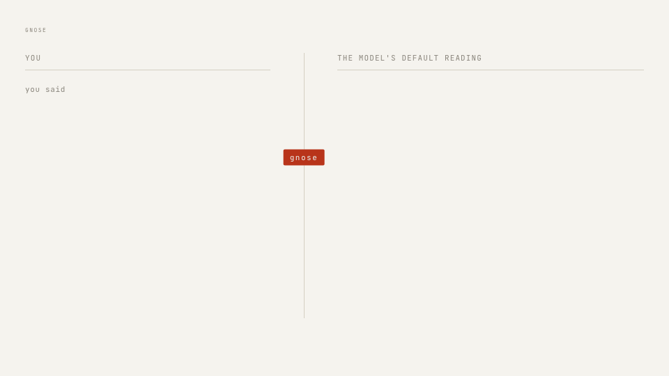
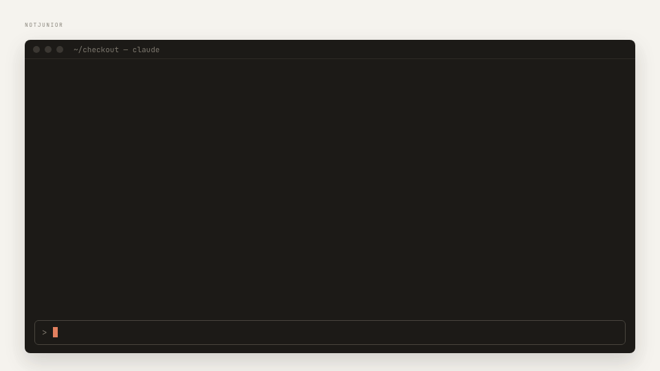

# inthepond-skills

From [inthepond](https://inthepond.com.au/) — more novel things live there; come say hello.

A small set of Skills, built one at a time from a written spec. Each skill is a folder with a `SKILL.md` entry point, a `references/` directory for depth that loads on demand, and optional `assets/`.

## Why this exists

This skill directory is not here to make you more productive.

Most tools built on top of language models are aimed at output: more of it, faster, with less of you in the loop. The skills here point the other way. They exist to give creativity and thinking back to the person using the model — by making the model's own reading visible, by declining to draw conclusions on your behalf, and by leaving the differences for you to find.

A model is very good at supplying a default. These skills are here so the default stays yours to accept, correct, or refuse.

## gnose

An introspection layer between you and the model.

Gnose makes visible how an LLM interprets your words — the default reading, the shape of each loaded concept, the parts of a long prompt it weights or ignores — so you can correct that reading in your own language and get your prompt reshaped to what you actually meant.



### What it does

Three modes, chosen automatically from the input:

| Mode | Input | Output |
|---|---|---|
| **short** | one utterance | 01 what it heard · 02 the shape of each concept (with semantic neighbors) · 03 what it didn't hear |
| **long_predict** | a long prompt, SKILL, or system prompt | which parts an LLM would weigh high / medium / low / ignore, and where the reading is likely to diverge from your intent |
| **long_diagnose** | a prompt plus an output you're unhappy with | evidence-based weights and divergences, most impactful first |

After a report you correct any reading conversationally ("by *simple* I meant easy to build"), and when you say "reshape", Gnose restates your prompt so the default reading matches the corrected intent — in your voice, at your length.

### What it is not

- Not a prompt optimizer. It never judges a prompt as "bad" or teaches best practices.
- Not a linter. No rules, no scores, no percentages.
- Not a wrapper. It exposes the model's reading; it doesn't decorate it.

Every report ends the same way: *No conclusion is offered. The differences, if any, are yours to find.*

### Install

Claude Code — add this repo as a plugin marketplace, then install the skill by name:

```
/plugin marketplace add inthepond/inthepond-skills
/plugin install gnose@inthepond-skills
```

Any agent that reads `SKILL.md` folders (Claude Code, Cursor, Codex, and others) — one command, installs just this skill:

```
npx skills add inthepond/inthepond-skills --skill gnose
```

Add `-g` to install for your user rather than the current project. Or copy the `gnose/` folder into your skills directory by hand (for Claude Code: `~/.claude/skills/gnose/`).

### Use it

Then, in a conversation:

- "gnose this prompt: …"
- "how would Claude read this system prompt?"
- "why didn't it get what I meant? here's the prompt and the output …"

Ask for "a shareable version" to get the report as a page ([`gnose/assets/report.html`](gnose/assets/report.html)).

### Files

- [`gnose/SKILL.md`](gnose/SKILL.md) — entry point, principles, workflow, and the protected-phrase table that governs edits
- [`gnose/references/modes.md`](gnose/references/modes.md) — the three mode recipes and report layouts
- [`gnose/references/reshape.md`](gnose/references/reshape.md) — reshape rules (translator, not optimizer)
- [`gnose/assets/report.html`](gnose/assets/report.html) — report template for the shareable page
- [`gnose/assets/gif-src/`](gnose/assets/gif-src/) — source and build script for the GIF above

## samesame

*Same same, but different.* A harness for carrying a UI through a transition while its functionality stays fixed.

Born from a real story: a developer ports an AngularJS app to modern Angular, everything works, and the UI looks utterly different — but describing two hundred visual defects to a coding agent piece by piece costs more than porting by hand, so the agent gets abandoned. Samesame removes the human from the *find → describe → verify* loop: it builds the agent its own eyes (a local screenshot + computed-style harness over both versions), writes one plan you approve, then converges increment by increment — resumable whenever your thirty minutes are up.

### What it does

Two modes, chosen from your intent:

| Mode | You want | Ground truth | Verified by |
|---|---|---|---|
| **match** | the new stack to look like the old one (ports, upgrades) | the legacy UI, captured | pixel diffs + computed-style deltas, converged cause by cause |
| **overhaul** | a new look that loses no functionality (redesigns) | a functional inventory of every route, control, form, field | a coverage contract — every item mapped to a treatment; removals need your explicit approval |

In both modes: an itemized plan with evidence you can open, one explicit approval gate before any code changes, checkpointed increments, and a `state.json` so "continue samesame" resumes after any gap.

### What it is not

- Not a redesign oracle — direction and acceptance are yours; it never judges what looks better.
- Not a cloud service — everything is local (Playwright + pixelmatch as isolated dev-deps, with a hand-captured-screenshots fallback for locked-down machines). Nothing leaves your machine.
- Not a big-bang rewriter — no code before approval; every step small, checkpointed, revertable.

### Install

Claude Code:

```
/plugin marketplace add inthepond/inthepond-skills
/plugin install samesame@inthepond-skills
```

Any agent that reads `SKILL.md` folders:

```
npx skills add inthepond/inthepond-skills --skill samesame
```

### Use it

- "the port works but looks completely different — samesame it"
- "redesign this UI with our design system, but don't lose a single feature"
- "continue samesame" (tomorrow, or next month)

### Files

- [`samesame/SKILL.md`](samesame/SKILL.md) — entry point: principles, mode classification, workflow, edge cases
- [`samesame/references/inventory.md`](samesame/references/inventory.md) — enumerating routes, states, and the functional inventory
- [`samesame/references/harness.md`](samesame/references/harness.md) — the three capture tiers, config, auth, re-capture discipline
- [`samesame/references/match.md`](samesame/references/match.md) — cause taxonomy and the convergence loop
- [`samesame/references/overhaul.md`](samesame/references/overhaul.md) — design direction, the coverage contract, execution order
- [`samesame/references/plan-format.md`](samesame/references/plan-format.md) — plan file, approval protocol, state and resuming
- [`samesame/assets/harness/`](samesame/assets/harness/) — capture/diff/login script templates copied into each project's `.samesame/harness/`

## notjunior

*Know why, not just what.* A senior engineer beside you, with your codebase open.

Born from two things seen too often: graduates in interviews reading textbook answers off a phone propped beside the monitor, and developers shipping code their coding agent wrote without knowing what it does — or why the system around it is built that way — until the incident nobody can resolve. Notjunior explains your project with evidence: how code gets to production, why the architecture has its shape, what each technology is for, how a feature actually runs, how incidents get handled. Then it asks you to explain it back. Work is a loop of making mistakes, learning, and doing better; "I don't know — here's how I'd find out" is treated as the senior answer it is.



### What it does

Eight lenses, chosen from your question:

| Lens | You ask | You get |
|---|---|---|
| **lifecycle** | "how does my code get to production?" | the journey of a change, stage by stage — what happens, the failure each gate prevents, what to do when it goes red, and what isn't there |
| **architecture** | "why is it built like this?" | three zooms (the system, the deployables, your component), each boundary with its protocol, trust, and blast radius, and the alternative not taken |
| **stack** | "what is X and why do we use it?" | each technology's job here, its alternatives, why it was chosen, what it costs, its sharp edges, and what to learn first |
| **trace** | "how does feature X actually work?" | an end-to-end walk with `file:line` per hop — data shape, error paths, what you'd see in the logs — then the unhappy path for you to trace yourself |
| **incident** | "prod is down" / "run a drill" | live: stabilise, escalate, preserve evidence — no lecture · drill: a game day built from your architecture, where you make the calls · readiness: how the project detects, alerts, and recovers |
| **concepts** | "explain CORS / idempotency properly" | layered — one sentence, a picture (and where it breaks), the mechanics, where it lives in your code, good vs bad, how it fails, what a senior checks |
| **own** | "Claude just wrote this — do I understand it?" | you explain the diff first; then the gaps, what the reviewer will ask, and how you'd debug and roll it back at 3am |
| **rehearse** | "let me explain X" / "here's a job description" | feedback on accuracy, depth, precision, and honesty; your own phrasing tightened; mock-interviewer follow-ups; a job description mapped to what you've actually done |

Every claim about your project is cited, or labelled **documented**, **inferred**, or **unknown** — and the unknowns become your questions for the team. An optional, local `.notjunior/` notebook (kept out of git through `.git/info/exclude`) remembers what you know, what you've corrected, and what you still need to ask.

### What it is not

- Not a code generator — while it's active it explains; your normal workflow writes the code.
- Not an interview aid — it rehearses before and after. It declines to answer during a live interview or assessment, and never inflates what you've done.
- Not a codebase summariser — the understanding is meant to end up in your head, checked by you explaining it back.

### The mod

The skill only runs when you ask. The moment that matters most — code Claude wrote, about to ship unexplained — is when nobody asks. So notjunior also ships a Claude Code [mod](https://code.claude.com/docs/en/plugins/mods/overview) that watches the normal workflow:

- **A quiet band above the prompt** after a turn in which Claude changed files: *Claude changed 3 files you haven't explained back* · **Check I understand it** · **Later**. The check sends the `own` request in your words; Later hides the band until the next turn that edits files.
- **The commit moment**: when Claude is about to `git commit`, `git push`, or `gh pr create` with changes still unexplained, the `shipCheck` setting decides — `nudge` (the default: a reminder, then it runs), `hold` (refused until you run the check), or `off`. Set it in `/config`.
- **`/notjunior-check`** puts the check request in your prompt box for you to send; **`/notjunior-notebook`** shows your notebook — open questions for your team, misconceptions you've corrected, how far the map has fallen behind `HEAD`.
- **A hand-off to the skill**: when notjunior loads, it is told which files Claude changed this session, so `own` checks exactly what was written for you.

It counts what changed during Claude's turns — through its edit tools or the shell, committed or not — and leaves out what you changed yourself between turns, and anything outside the project. It makes no network or model calls and writes nothing; it reads `.notjunior/` and runs read-only `git`. The band and pane draw in a terminal — VS Code's integrated terminal included — and in the Desktop app's Code tab. In the VS Code extension's chat panel and in headless runs nothing a mod draws appears, so the nudge comes from Claude in the conversation instead; the hold, the hand-off, and the commands' text replies work everywhere. The mod needs Claude Code 2.1.287 or later; other agents installing with `npx skills` get the skill alone.

### Install

Claude Code — the skill and the mod together:

```
/plugin marketplace add inthepond/inthepond-skills
/plugin install notjunior@inthepond-skills
```

Any agent that reads `SKILL.md` folders (the skill only):

```
npx skills add inthepond/inthepond-skills --skill notjunior
```

### Use it

- "how does my code get to production here, and why all these steps?"
- "explain CORS properly — and show me where it matters in this repo"
- "trace what happens when a user submits a booking"
- "run an incident drill on this project"
- "Claude just wrote this diff — check I actually understand it"
- "here's a job description — what can I honestly claim?"
- `/notjunior-check` after Claude has changed things; `/notjunior-notebook` to see what you still need to ask

### Files

- [`notjunior/README.md`](notjunior/README.md) — the skill's own page, with the GIF
- [`notjunior/SKILL.md`](notjunior/SKILL.md) — entry point: principles, the senior questions, lens classification, workflow, guardrails
- [`notjunior/references/evidence.md`](notjunior/references/evidence.md) — where the *what* and the *why* live, the labels, docs-versus-code drift, reading safely
- [`notjunior/references/lifecycle.md`](notjunior/references/lifecycle.md), [`architecture.md`](notjunior/references/architecture.md), [`stack.md`](notjunior/references/stack.md), [`trace.md`](notjunior/references/trace.md) — the project lenses
- [`notjunior/references/incident.md`](notjunior/references/incident.md) — live, drill, readiness, and post-incident review
- [`notjunior/references/concepts.md`](notjunior/references/concepts.md) — how to explain a concept; [`atlas.md`](notjunior/references/atlas.md) — good-vs-bad contrasts across networking, APIs, security, data, resilience, delivery, operations, design, testing, and working with coding agents
- [`notjunior/references/own.md`](notjunior/references/own.md) — understanding a diff before you ship it
- [`notjunior/references/rehearse.md`](notjunior/references/rehearse.md) — check-back, rehearsal, job-description mapping, and the live-interview guardrail
- [`notjunior/references/notebook.md`](notjunior/references/notebook.md) — the `.notjunior/` notebook, resuming, and staleness
- [`notjunior/.claude-plugin/plugin.json`](notjunior/.claude-plugin/plugin.json) — the plugin manifest: the skill at the root, the mod's state contract, the `shipCheck` setting
- [`notjunior/hooks/register.tsx`](notjunior/hooks/register.tsx) — the mod: the band, the commit moment, the commands, the hand-off; [`notebook.ts`](notjunior/hooks/notebook.ts) — its pure helpers
- [`notjunior/types/index.d.ts`](notjunior/types/index.d.ts) — the mod's `$.state` contract
- [`notjunior/tests/notjunior.test.ts`](notjunior/tests/notjunior.test.ts) — run with `claude plugin test notjunior`
- [`notjunior/assets/gif-src/`](notjunior/assets/gif-src/) — source and build script for the GIF above
